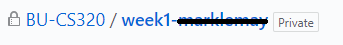

# Lab 2

## Before

Review the [video](https://www.youtube.com/watch?v=fXbWsMHKI5A) that was posted 9/11.

## Setup (similar to lab1) TODO link
1. Follow this [link](TODO) to create an assignment repository
  * Press the "Accept this assignment" button, this will create a private repository for your solutions
  * When the cloning finishes, you will see a link like "Your assignment has been created here: [link to your new private repo]", click that link.  You will know you are looking at your private repo becuase you will see  on the top of the web page.
1. Clone your personal assignment repo with the commandline ```git clone https://github.com/BU-CS320/week2-username.git``` with ```username``` replaced with your user name
1. ```cd``` into the newly created directory by typing ```cd week2-username``` with ```username``` replaced with your user name
1. You always want to take advantage of the latest corrections to the assignments and shared tests so we will add the main repository as a source
  * In your terminal type ```git remote add upstream https://github.com/BU-CS320/Fall-2018.git```
  * check that it worked by typing ```git remote -v```.  You should see see the line ```upstream https://github.com/BU-CS320/Fall-2018.git (fetch)```
  * You always want to keep your assignment up to date by running ```git pull upstream master```, do that now
1. ```cd```  into this assignment (```cd assignments/week2/lab2```), first we will write a greeting
  * run ```cabal new-repl``` (or ```cabal repl``` if gets "Failed to load interface") in the terminal (it is important that you do this in the ```lab2``` directory).
  * in your favorite text editor open ```src/Data.hs```
  
## REPL hints


## ```git``` issues
If you are having ```git``` issues run ```git status``` and call on Mark for help.

## Optional Bonus: Sharing Tests, and correcting my spelling
We will allow you to share tests with the class. To do this 
 * Make a fork of the class repo: https://github.com/BU-CS320/Fall-2018
 * clone your fork locally (keep it separate from your assignment clone)
 * go to the test directory (in this case Fall-2018/assignments/week2/lab2/tests)
 * add a test
 * push the test up to your fork
 * https://help.github.com/articles/creating-a-pull-request/
 * If your test looks good we will accept it
