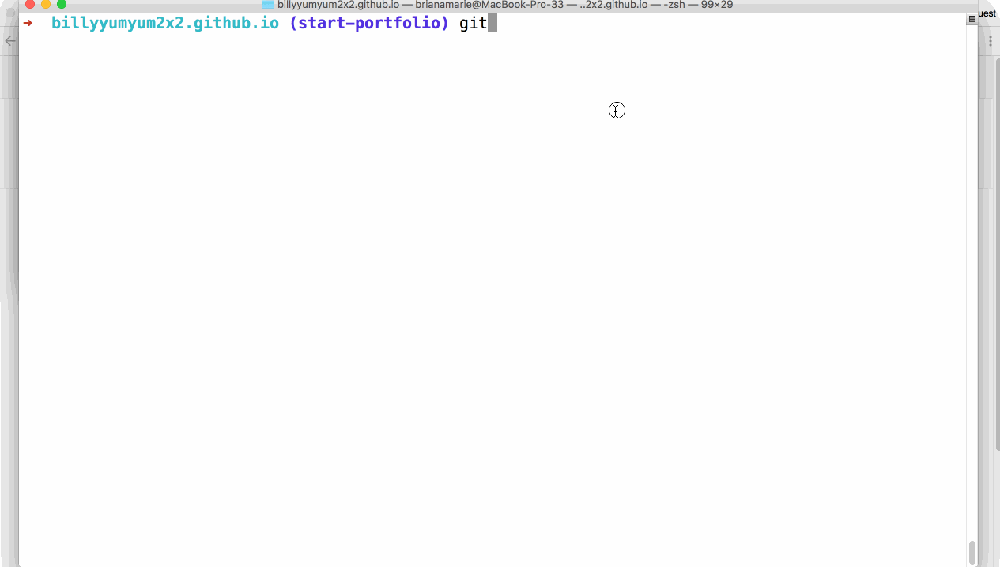

# HW Due 9/25
Lab and HW are combined this week.

## Before
Read about Haskell modules: https://www.haskell.org/tutorial/modules.html

## Setup
similar to [lab2](../../week2/lab2)
1. Follow this [link](https://classroom.github.com/a/fyIl3cE-) to create an assignment repository
1. Clone your personal assignment repo with the command line ```git clone https://github.com/BU-CS320/week2-username.git``` with ```username``` replaced with your user name
1. ```cd``` into the newly created directory by typing ```cd week2-username``` with ```username``` replaced with your user name
1. set the public upstream repo with ```git remote add upstream https://github.com/BU-CS320/Fall-2018.git```
1. ```cd```  into this assignment (```cd assignments/week3/hw```), first we will write a greeting
   1. run ```cabal new-repl``` (or ```cabal repl``` if gets "Failed to load interface") in the terminal (it is important that you do this in the ```hw``` directory).
   1. in your favorite text editor open ```src/WarmUp.hs``` and answer the questions

## Submit
similar to [lab2](../../week2/lab2)
1. run the tests by running ```cabal test``` (this step is less important for this lab since many of the answers are open ended)
1. run ```git status``` to make sure everything is ok
1. run ```git commit -a -m "done with another HW!"``` to make a commit on your laptop
1. run ```git push``` to submit your work
1. check that you can see your solutions on the website for your private repo

## REPL commands
 * ```:load x``` will load a different module, in this lab the options are ```DataProblems```, ```TypeProblems```, ```Set```, ```BinarySearchTrees```, ```HigherOrderProblems```, ```WarmUp```
 * ```:reload``` reloads the module
 * ```:type x``` tells you the type of x
 * ```:q``` quits out of the REPL

## Problems
### ```Set.hs```
Implement a Set as a sorted list.
### ```BinarySearchTrees.hs```
Implement a Binary Search Tree.
### ```Outside.hs```
Implement the functions (you can only use what the modules expose). Note that both ```Set``` and ```BinarySearchTrees``` have ```insert``` as stated in the reading you can call the specific function using the fully qualified name ```Set.insert``` and ```BinarySearchTrees.insert```.
### ```DataProblems.hs```
Implement the data types and the functions on them
### ```TypeProblems.hs```
Solve all the type puzzles
### ```WarmUp.hs```
Implement datatype and functions anyway you like (no compiler warnings or errors allowed!)
### ```HigherOrderProblems.hs```
Implement the functions

## Hints
 * start early and submit tests
 * refresh the cabal REPL constantly
 * commit and push to your private repo often
 * check your github private repo that you work has been submitted
 * it is best to pull in form the upstream after you have committed and pushed to your private repo.

## Notes
 * You can ignore the warning about ```warning: [-Wmissing-home-modules]``` it seems to be related to this bug https://github.com/haskell/cabal/issues/4711.
 * As I mentioned in the later labs the ```type Set = [Integer]``` in ```Set.hs``` leaks some information unintantionally.  It would have been more correct to write ```data Set = Set [Integer]```.  Since the leaky way is easier to implement and gives us a way to test, I will leave the assignment like that.
### 9:05 Lab
 * I incorrectly stated that ```BinarySearchTrees``` didn't have an "empty".  This is wrong, it is ```Null```
   
## Sharing Tests, and correcting my spelling
We will allow you to share tests with the class. To do this 
 * Make a fork of the class repo: https://github.com/BU-CS320/Fall-2018
 * clone your fork locally (keep it separate from your assignment clone)
 * go to the test directory (in this case Fall-2018/assignments/week2/lab2/tests)
 * add a test
 * push the test up to your fork
 * https://help.github.com/articles/creating-a-pull-request/
 * If your test looks good we will accept it

 ## More detailed explanation for forking and adding tests
 Once you have followed the steps for forking a repository all you need to do now is clone the forked repository into your terminal. Then follow these steps:
 1. Need to add the ability to update your forked repository to keep it up to date with the master branch
 	1. '''cd'' into your forked repo
 	1. type '''git remote add upstream https://github.com/BU-CS320/Fall-2018.git''' 
 	1. type '''git fetch upstream''' then '''git pull upstream''' to update your forked repository with the master branch
 	1. Now just make your edits, whether it be fixing typos, adding test cases, etc.
 	1. Once you have made your changes, all you need to is push your changes to your forked repo to save your work.
 1. Pushing your work to the masterbranch
 	1. Once you push your changes, go onto github and click the tab pull requests.
 	1. Once in this tab, hit the button that says __New pull request__
 	1. Once you get to this page, you will see this at the top . This will compare your forked repository with the master branch.
 	1. Then click __Create a new pull__
 	1. Add any comment you want
 	1. Then click __Create a new pull__ at the bottom of the page 
 	1. After this you should have successfully put in the pull request, and now just wait for the person with the access to the master branch to accept the request.
